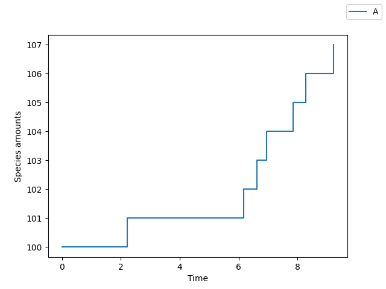
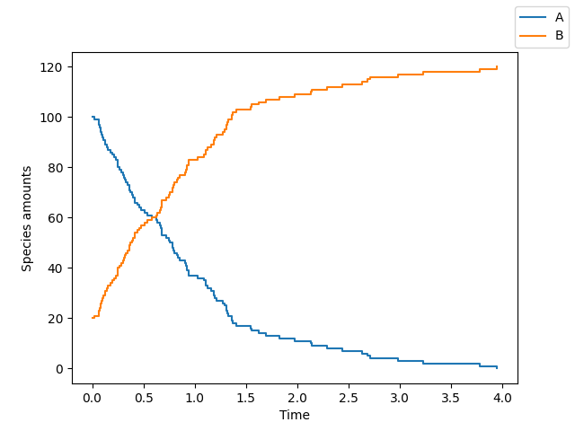
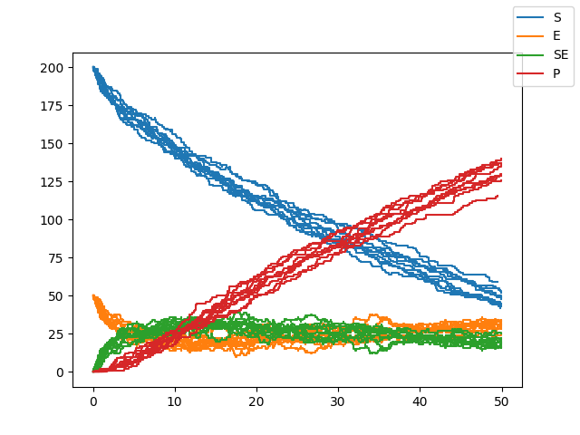

Examples
========

Here we discuss some example systems and how to code them up using ``cayenne``.

Zero order system
-----------------
.. math::

    \phi &\xrightarrow[]{k_1} A\\
    \\
    k_1 &= 1.1\\
    A(t=0) &= 100\\

This can be coded up with::

    >>> from cayenne import Simulation
    >>> model_str = """
            const compartment comp1;
            comp1 = 1.0; # volume of compartment

            r1:  => A; k1;

            k1 = 1.1;
            chem_flag = false;

            A = 100;
        """
    >>> sim = Simulation.load_model(model_str, "ModelString")
    >>> sim.simulate()
    >>> sim.plot()

First order system
------------------

.. math::

    A &\xrightarrow[]{k_1} B\\
    \\
    k_1 &= 1.1\\
    A(t=0) &= 100\\
    B(t=0) &= 20\\

This can be coded up with::

    >>> from cayenne import Simulation
    >>> model_str = """
            const compartment comp1;
            comp1 = 1.0; # volume of compartment

            r1: A => B; k1;

            k1 = 1.1;
            chem_flag = false;

            A = 100;
            B = 20;
        """
    >>> sim = Simulation.load_model(model_str, "ModelString")
    >>> sim.simulate()
    >>> sim.plot()

Suppose you want to use the ``tau_leaping`` algorithm, run 20 repetitions and plot only species :math:`B`. Then do::

    >>> sim.simulate(algorithm="tau_leaping", n_rep=20)
    >>> sim.plot(species_names=["B"], new_names=["Species B"])

.. image:: ../docs/images/ex_1b.png
    :scale: 80%
    :align: center
    :alt: Plot of a first order system with more repetitions.

Enzyme kinetics (second order system with multiple reactions)
-------------------------------------------------------------

.. math::

    \text{Binding}: S + E &\xrightarrow{k1} SE \\
    \text{Dissociation}:SE &\xrightarrow{k2} S + E \\
    \text{Conversion}: SE &\xrightarrow{k3} P + E \\
    \\
    k1 &= 0.006 \\
    k2 &= 0.005 \\
    k3 &= 0.1 \\
    S(t=0) &= 200\\
    E(t=0) &= 50\\
    SE(t=0) &= 0\\
    P(t=0) &= 0\\

This can be coded up with::

    >>> from cayenne import Simulation
    >>> model_str = """
            const compartment comp1;
            comp1 = 1.0; # volume of compartment

            binding: S + E => SE; k1;
            dissociation: SE => S + E; k2;
            conversion: SE => P + E; k3;

            k1 = 0.006;
            k2 = 0.005;
            k3 = 0.1;
            chem_flag = false;

            S = 200;
            E = 50;
            SE = 0;
            P = 0;
        """
    >>> sim = Simulation.load_model(model_str, "ModelString")
    >>> sim.simulate(max_t=50, n_rep=10)
    >>> sim.plot()

.. image:: ../docs/images/ex_2a.png
    :scale: 80%
    :align: center
    :alt: Plot of enzyme kinetics simulation.

Since this is a second order system, the size of the system affects the reaction rates. What happens in a larger system? ::

    >>> from cayenne import Simulation
    >>> model_str = """
            const compartment comp1;
            comp1 = 5.0; # volume of compartment

            binding: S + E => SE; k1;
            dissociation: SE => S + E; k2;
            conversion: SE => P + E; k3;

            k1 = 0.006;
            k2 = 0.005;
            k3 = 0.1;
            chem_flag = false;

            S = 200;
            E = 50;
            SE = 0;
            P = 0;
        """
    >>> sim = Simulation.load_model(model_str, "ModelString")
    >>> sim.simulate(max_t=50, n_rep=10)
    >>> sim.plot()

Here we see that the reaction proceeds slower. Less of the product is formed by ``t=50`` compared to the previous case.
