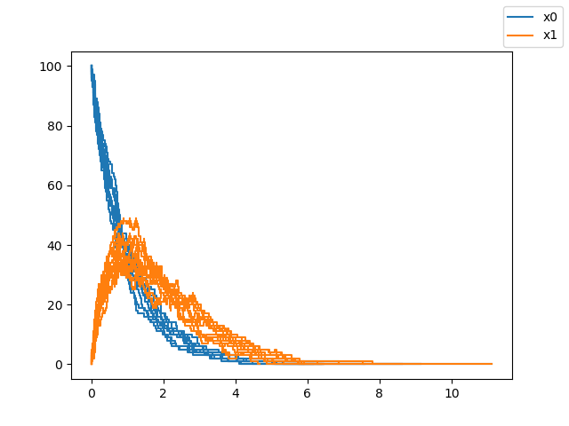

========
Tutorial
========

Model Building
++++++++++++++

Consider a simple system of chemical reactions given by:

.. math::

    A \xrightarrow[]{k_1} B\\
    B \xrightarrow[]{k_2} C \\

Suppose k\ :sub:`1` = 1, k\ :sub:`2` 1 and there are initiall 100 units of A. Then we have the following variable definitions ::

    k1, k2 = 1.0, 1.0
    A0, B0, C0 = 100, 0, 0

Then to build the model we have the following variable definitions::

    import numpy as np
    V_r = np.array([[1, 0], [0, 1], [0, 0]])
    V_p = np.array([[0, 0], [1, 0], [0, 1]])
    X0 = np.array([A0, B0, C0])
    k = np.array([k1, k2])

Running Simulations
+++++++++++++++++++

Suppose we want to run 10 runs of the system for earlier of 1000 time steps / 150 time units each, we have ::

    from pyssa.simulation import Simulation

    sim = Simulation(V_r, V_p, X0, k)
    sim.simulate(max_t=150, max_iter=1000, chem_flag=True, n_rep=10)

Note that the ``chem_flag`` is set to ``True`` since we are dealing with a chemical system.

Plotting
++++++++

To plot the results on the screen, we simply have ::

    sim.plot()

.. image:: ../docs/images/plot_basic.png
    :scale: 70%
    :align: center
    :alt: Plot of A, B and C species over time.

To plot only A and B, we use the species indices (``[0,1]``) ::

    sim.plot(plot_indices = [0, 1])

To not display the plot on the screen and retrieve the figure and axis objects, we have ::

    fig, ax = sim.plot(disp = False)

Accessing the results
+++++++++++++++++++++

The results of the simulation can be retrieved by accessing the ``Results`` object as ::

    results = sim.results

.. code-block:: python

    <Results n_rep=10 algorithm=direct seed=[0, 1, 2, 3, 4, 5, 6, 7, 8, 9]>

The ``Results`` object provides abstractions for easy retrieval and iteration over the simulation results. For example you can iterate over every run of the simulation using ::

    for x, t, status in results:
        pass

You can access the results of the ``n`` th run by ::

    nth_result = results[n]

You can also access the final states of all the simulation runs by ::

    final_times, final_states = results.final

.. code-block:: python

    #final_times
    array([ 7.59679567,  6.370443  ,  8.62018373,  6.44826162,  6.42278186,
        4.66472231,  6.15595516,  5.87319502,  9.13955542, 11.12529717])
    #final_states
    array([[  0.,   0., 100.],
       [  0.,   0., 100.],
       [  0.,   0., 100.],
       [  0.,   0., 100.],
       [  0.,   0., 100.],
       [  0.,   0., 100.],
       [  0.,   0., 100.],
       [  0.,   0., 100.],
       [  0.,   0., 100.],
       [  0.,   0., 100.]])

Algorithms
++++++++++

The ``Simulation`` class currently supports the following algorithms:

1. Direct
2. Tau leaping

You can change the algorithm used to perform a simulation using the ``simulation`` flag

.. code-block:: python

    sim.simulate(max_t=150, max_iter=1000, chem_flag=True, n_rep=10, algorithm="tau_leaping")
